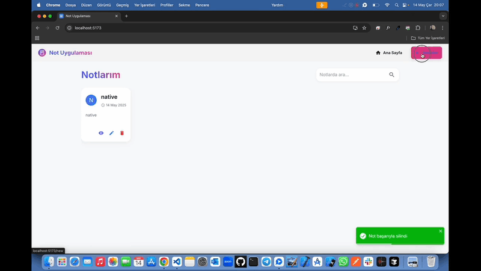

# NotApp-Cursor 📝

<li>Bu proje Cursor yapay zeka yardımıyla hazırlanmış NotApp sitesidir. </li>
<li>Not ekleme,düzenleme,silme özellikleri mevcuttur.</li>
<li>Etiket ekleme ve filtreleme entegre edilmiştir.</li>
<li>Kullanıcı dostu modern responsive tasarımı vardır.</li>

# Kullanılan Teknolojiler 🎨

<li>⭐ Cursor</li>
<li>⭐ TypeScript</li>
<li>⭐ React</li>
<li>⭐ Vite</li>
<li>⭐ Mui-Material</li>
<li>⭐ React-Toolkit</li>
<li>⭐ Uuid</li>
<li>⭐ Tailwindcss</li>
<li>⭐ Toastify</li>
<li>⭐ Quill</li>
<li>⭐ Persist</li>

# Ekran Görüntüsü 🎥
    

# İletişim 📩
yunusemreoral@hotmail.com.tr
